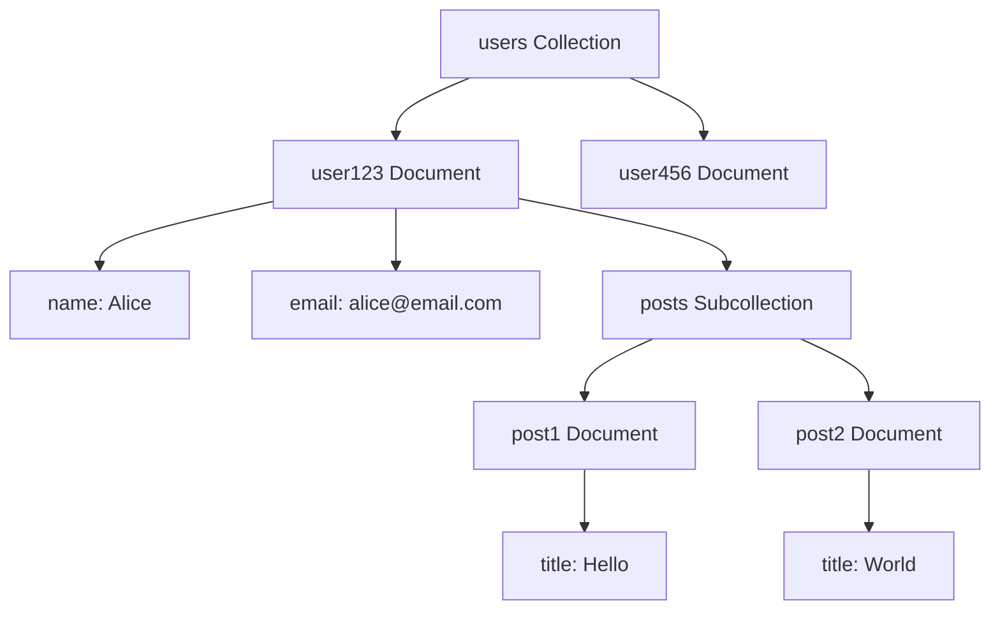
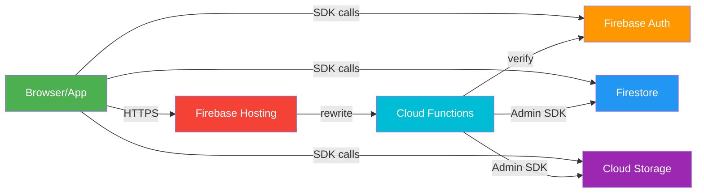

# Firebase — Google's Full-Stack BaaS Platform

---

> **BaaS** (Backend-as-a-Service): Firebase gives you **serverless** backend services — no managing servers, just use SDKs.

```
┌──────────────────────────────────────────────────┐
│                  FIREBASE                        │
│  ┌──────────┐ ┌──────┐ ┌────────┐ ┌──────────┐   │
│  │ Firestore│ │ Auth │ │ Storage│ │Functions │   │
│  │ (NoSQL   │ │(Users│ │ (Files,│ │(Server-  │   │
│  │  DB)     │ │&Login)│ │ Images)│ │ side     │  │
│  └──────────┘ └──────┘ └────────┘ └──────────┘   │
│  ┌──────────┐ ┌──────────┐ ┌───────────────┐     │
│  │ Hosting  │ │ Emulator │ │ Firebase SQL  │     │
│  │ (Deploy) │ │ Suite    │ │ Connect (SQL) │     │
│  └──────────┘ └──────────┘ └───────────────┘     │
└──────────────────────────────────────────────────┘
```

---

## 1. Firebase Project Setup

### 1.1 Create a Firebase Project

```bash
1. Go to https://console.firebase.google.com
2. Click "Add project" → name it → Create
3. (Optional) Disable Google Analytics for dev
```

### 1.2 Register Your Web App

```js
// In Firebase Console → Project Settings → Your apps → Add app → Web
// You get a config object like this:

const firebaseConfig = {
  apiKey: "AIzaSy...",
  authDomain: "my-project.firebaseapp.com",
  projectId: "my-project",
  storageBucket: "my-project.appspot.com",
  messagingSenderId: "123456789",
  appId: "1:123456789:web:abc123"
};
```

### 1.3 Install & Initialize

```bash
npm install firebase
```

```js
import { initializeApp } from 'firebase/app';
import { getFirestore } from 'firebase/firestore';
import { getAuth } from 'firebase/auth';
import { getStorage } from 'firebase/storage';

const app = initializeApp(firebaseConfig);

const db = getFirestore(app);     // Firestore database
const auth = getAuth(app);        // Authentication
const storage = getStorage(app);  // Cloud Storage
```

```
✅  DONE — you now have a fully functional backend.

    No server code. No provisioning. Just SDK calls.
```

---

## 2. Cloud Firestore — NoSQL Database

### 2.1 Data Model

```
Firestore organizes data as:

  Collection → Document → { fields }
       │           │
       │           └── Can have subcollections
       └── Container of documents

Example:

  users (collection)
    └── "user123" (document)
          ├── name: "Alice"
          ├── email: "alice@email.com"
          └── posts (subcollection)
                ├── "post1" → { title: "Hello", content: "..." }
                └── "post2" → { title: "World", content: "..." }
```



### 2.2 CRUD Operations

```js
import { 
  collection, addDoc, getDocs, getDoc, 
  doc, updateDoc, deleteDoc, query, where, onSnapshot 
} from 'firebase/firestore';

// ─── CREATE ───
const docRef = await addDoc(collection(db, 'items'), {
  name: 'Laptop',
  price: 999,
  inStock: true
});
console.log('Added with ID:', docRef.id); // auto-generated ID

// ─── READ (one) ───
const docSnap = await getDoc(doc(db, 'items', 'abc123'));
if (docSnap.exists()) {
  console.log(docSnap.data()); // { name: 'Laptop', price: 999, ... }
}

// ─── READ (all) ───
const querySnapshot = await getDocs(collection(db, 'items'));
querySnapshot.forEach(doc => console.log(doc.id, doc.data()));

// ─── READ (filtered) ───
const q = query(collection(db, 'items'), where('price', '>', 500));
const filtered = await getDocs(q);

// ─── UPDATE ───
await updateDoc(doc(db, 'items', 'abc123'), {
  price: 899
});

// ─── DELETE ───
await deleteDoc(doc(db, 'items', 'abc123'));
```

### 2.3 Real-time Listener (Live Updates)

```js
// Automatically fires callback when data changes
const unsubscribe = onSnapshot(collection(db, 'items'), (snapshot) => {
  snapshot.docChanges().forEach((change) => {
    if (change.type === 'added')   console.log('New:', change.doc.data());
    if (change.type === 'modified') console.log('Updated:', change.doc.data());
    if (change.type === 'removed') console.log('Deleted:', change.doc.data());
  });
});

// Later: stop listening
unsubscribe();
```

### 2.4 Offline Support (Enabled by Default on Web)

```
Firestore caches data automatically:

  ┌──────────┐     offline     ┌──────────────┐
  │  Browser  │ ←────────────→ │ Firestore    │
  │  (Cache)  │     online     │  (Cloud)     │
  └──────────┘                 └──────────────┘

  Reads:    Falls back to cache when offline
  Writes:   Queued locally, synced when back online
```

---

## 3. Firebase Authentication

### 3.1 Supported Providers

```
┌─────────────────┬──────────────────────────────┐
│ Provider        │ Code                         │
├─────────────────┼──────────────────────────────┤
│ Email/Password  │ signInWithEmailAndPassword() │
│ Google          │ signInWithPopup(googleProvider│
│ Facebook        │ signInWithPopup(fbProvider)  │
│ Apple           │ signInWithPopup(appleProvider│
│ Phone (SMS)     │ signInWithPhoneNumber()      │
│ Anonymous       │ signInAnonymously()          │
│ Custom Token    │ signInWithCustomToken()      │
└─────────────────┴──────────────────────────────┘
```

### 3.2 Email/Password Auth

```js
import { 
  createUserWithEmailAndPassword,
  signInWithEmailAndPassword,
  signOut,
  onAuthStateChanged
} from 'firebase/auth';

// ─── SIGN UP ───
async function signUp(email, password) {
  const userCred = await createUserWithEmailAndPassword(auth, email, password);
  return userCred.user; // { uid, email, ... }
}

// ─── SIGN IN ───
async function signIn(email, password) {
  const userCred = await signInWithEmailAndPassword(auth, email, password);
  return userCred.user;
}

// ─── SIGN OUT ───
await signOut(auth);

// ─── LISTEN TO AUTH STATE ───
onAuthStateChanged(auth, (user) => {
  if (user) {
    console.log('User is signed in:', user.uid);
  } else {
    console.log('User is signed out');
  }
});
```

### 3.3 Google Sign-In

```js
import { GoogleAuthProvider, signInWithPopup } from 'firebase/auth';

const provider = new GoogleAuthProvider();

async function signInWithGoogle() {
  const result = await signInWithPopup(auth, provider);
  const user = result.user;
  // user.displayName, user.photoURL, user.email, ...
}
```

### 3.4 Protecting Data with Auth (Security Rules)

```firebase
// firestore.rules
rules_version = '2';
service cloud.firestore {
  match /databases/{database}/documents {
    // Only authenticated users can read/write
    match /{document=**} {
      allow read, write: if request.auth != null;
    }
    
    // Users can only read/write their own data
    match /users/{userId} {
      allow read, write: if request.auth.uid == userId;
    }
  }
}
```

```
request.auth  →  The authenticated user info (set by Firebase Auth)
request.auth.uid  →  The user's unique ID
```

---

## 4. Cloud Storage (Files / Images)

### 4.1 Upload a File

```js
import { ref, uploadBytes, getDownloadURL } from 'firebase/storage';

// Create a reference to the file location
const storageRef = ref(storage, 'images/profile-pics/user123.jpg');

// Upload the file
const snapshot = await uploadBytes(storageRef, file); // file = File/Blob

// Get public download URL
const downloadURL = await getDownloadURL(snapshot.ref);
console.log('File available at:', downloadURL);
```

### 4.2 Storage Security Rules

```firebase
// storage.rules
rules_version = '2';
service firebase.storage {
  match /b/{bucket}/o {
    // Anyone can read, only auth can write
    match /{allPaths=**} {
      allow read: if true;
      allow write: if request.auth != null;
    }
    
    // Only owner can access their own folder
    match /users/{userId}/{allPaths=**} {
      allow read, write: if request.auth.uid == userId;
    }
  }
}
```

### 4.3 Upload Progress

```js
import { uploadBytesResumable } from 'firebase/storage';

const uploadTask = uploadBytesResumable(storageRef, file);

uploadTask.on('state_changed', 
  (snapshot) => {
    const progress = (snapshot.bytesTransferred / snapshot.totalBytes) * 100;
    console.log(`Upload: ${progress}%`);
  },
  (error) => console.error('Upload failed:', error),
  () => console.log('Upload complete!')
);
```

---

## 5. Cloud Functions — Serverless Backend Logic

### 5.1 What Are Cloud Functions?

```
Serverless functions that run in response to events:

  ┌──────────┐          ┌──────────────┐
  │  Event   │ ───────→ │ Cloud        │
  │ (HTTP,   │          │ Function     │
  │  DB, ...)│          │ (Node/Python)│
  └──────────┘          └──────┬───────┘
                               │
                        ┌──────▼───────┐
                        │ Do something │
                        │ (send email, │
                        │  process     │
                        │  payment,    │
                        │  clean data) │
                        └──────────────┘
```

### 5.2 Setup

```bash
npm install -g firebase-tools
firebase init functions  # Select TypeScript or JavaScript
```

### 5.3 Example: HTTP Function

```js
// functions/index.js
const functions = require('firebase-functions');
const admin = require('firebase-admin');
admin.initializeApp();

exports.helloWorld = functions.https.onRequest((req, res) => {
  res.json({ message: 'Hello from Firebase Cloud Function!' });
});

exports.createUserProfile = functions.auth.user().onCreate(async (user) => {
  // When a new user signs up, create a profile doc
  await admin.firestore().collection('users').doc(user.uid).set({
    email: user.email,
    createdAt: admin.firestore.FieldValue.serverTimestamp()
  });
});
```

### 5.4 Deploy

```bash
firebase deploy --only functions
```

---

## 6. Firebase Hosting — Deploy Your App

### 6.1 Setup Hosting

```bash
firebase init hosting
# Choose: public directory (default: "public")
# Choose: single-page app (yes for React/Vue)
# Choose: set up auto-build with GitHub (optional)
```

### 6.2 Deploy

```bash
npm run build          # Build your frontend
firebase deploy --only hosting
# Your app is live at: https://your-project.web.app
```

### 6.3 Hosting + Functions (Full-Stack)

```
┌─────────────────────────────────────┐
│  Firebase Hosting                   │
│                                     │
│  /   → serves index.html (SPA)      │
│  /api/* → rewrites to Cloud Function│
│                                     │
│  firebase.json:                     │
│  {                                  │
│    "hosting": {                     │
│      "rewrites": [                  │
│        { "source": "/api/**",       │
│          "function": "api" }        │
│      ]                              │
│    }                                │
│  }                                  │
└─────────────────────────────────────┘
```

---

## 7. Firebase Emulator Suite — Local Development

### 7.1 Why Emulators?

```
Without Emulators:
  You write code → deploy to production → test → find bug → redeploy
  (slow, costly, dangerous)

With Emulators:
  You write code → test locally → deploy when ready
  (fast, free, safe)
```

### 7.2 Setup Emulators

```bash
firebase init emulators
# Select: Firestore, Auth, Storage, Functions, Hosting
```

### 7.3 Using Emulators

```bash
firebase emulators:start
# Starts local servers:
#   Firestore:  http://localhost:8080
#   Auth:       http://localhost:9099
#   Storage:    http://localhost:9199
#   Functions:  http://localhost:5001
#   Hosting:    http://localhost:5000
#   Emulator UI: http://localhost:4000  ← Visual dashboard
```

### 7.4 Connect Your App to Emulators

```js
import { connectFirestoreEmulator } from 'firebase/firestore';
import { connectAuthEmulator } from 'firebase/auth';

if (location.hostname === 'localhost') {
  connectFirestoreEmulator(db, 'localhost', 8080);
  connectAuthEmulator(auth, 'http://localhost:9099');
}
```

```
┌───────────────────────────────────────────────┐
│  🔥 EMULATOR UI (localhost:4000)              │
│                                               │
│  ┌──────────┐ ┌────────┐ ┌──────────────┐   │
│  │ Firestore│ │ Auth   │ │ Functions    │   │
│  │ 📄 View  │ │ 👤 View│ │ ⚡ View logs │   │
│  │   docs   │ │  users │ │   & errors   │   │
│  └──────────┘ └────────┘ └──────────────┘   │
└───────────────────────────────────────────────┘
```

---

## 8. Firebase SQL Connect (New in 2026)

### 8.1 What Is It?

```
Firebase SQL Connect = Managed PostgreSQL + Firebase SDK

Bridges the gap between NoSQL (Firestore) and SQL (PostgreSQL).

  ┌─────────────────┐          ┌─────────────────┐
  │  Firestore      │          │  Firebase SQL   │
  │  (NoSQL)        │     OR   │  Connect (SQL)  │
  │                 │          │                 │
  │  + Flexible     │          │  + Relations    │
  │  + Real-time    │          │  + Joins        │
  │  + Offline      │          │  + ACID         │
  │  - No joins     │          │  + SQL queries  │
  └─────────────────┘          └─────────────────┘
```

### 8.2 Use Cases

```
Firestore → Real-time collab, chat, mobile apps, simple CRUD
SQL Connect → Analytics, reporting, complex queries, financial data
Hybrid → Both! Use each where it shines
```

---

## 9. Firebase vs Alternatives (2026)

```
┌────────────┬──────────┬────────────┬──────────────┐
│ Feature    │ Firebase │ Supabase   │ AWS Amplify  │
├────────────┼──────────┼────────────┼──────────────┤
│ Database   │ Firestore│ PostgreSQL │ DynamoDB/Aur │
│            │ (NoSQL)  │ (SQL)      │ (NoSQL/SQL)  │
├────────────┼──────────┼────────────┼──────────────┤
│ Real-time  │ ✅ Great │ ✅ Good    │ ✅ Good      │
│ Offline    │ ✅ Built │ ⚠️ Limited │ ⚠️ Partial   │
│ Open Source│ ❌ No    │ ✅ Yes     │ ❌ No        │
│ Self-host  │ ❌ No    │ ✅ Yes     │ ❌ No        │
│ AI/ML      │ Gemini   │ pgvector   │ Bedrock      │
│ Free Tier  │ ✅ Gener.│ ✅ Gener.  │ ✅ Limited   │
│ Mobile SDK │ ✅ Mature│ ⚠️ Growing │ ✅ Good      │
└────────────┴──────────┴────────────┴──────────────┘
```

---

## 10. Firebase in the Full-Stack Architecture



---

## Quick Reference: Common Firebase Commands

```bash
# Firebase CLI
npm install -g firebase-tools     # Install CLI
firebase login                     # Login to Google
firebase init                      # Init a service (firestore, functions, etc.)
firebase emulators:start           # Run local emulators
firebase deploy                    # Deploy everything
firebase deploy --only firestore   # Deploy only Firestore rules
firebase deploy --only functions   # Deploy only functions
firebase deploy --only hosting     # Deploy only hosting

# Firestore rules deployment
firebase deploy --only firestore:rules

# View logs
firebase functions:log             # See function logs
```
