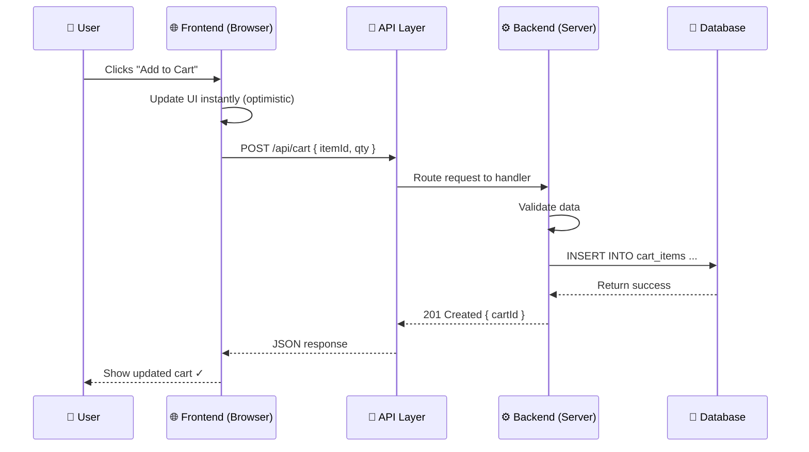
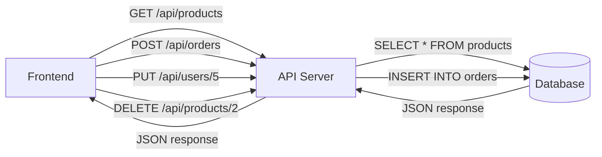
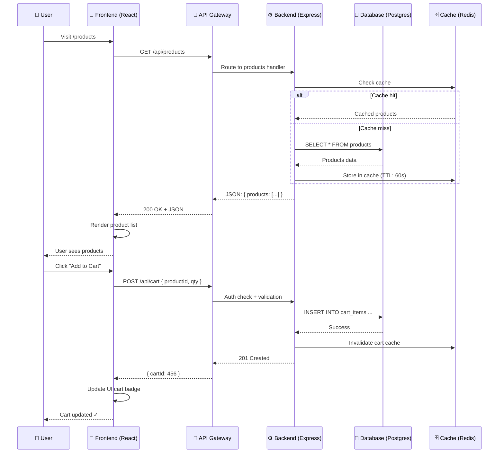

# Full-Stack Architecture — How Frontend, Backend & Database Work Together

---

## 1. What Is Full-Stack Architecture?

**Full-stack** = building both the **frontend** (what users see) and **backend** (server, database, logic) of an application.

```
┌─────────────────────────────────────────────────────┐
│                   FULL-STACK APP                     │
│                                                       │
│   ┌──────────────┐   ┌────────────┐   ┌──────────┐  │
│   │  FRONTEND    │──→│  BACKEND   │──→│ DATABASE │  │
│   │  (UI/UX)     │←──│  (Logic)   │←──│ (Data)   │  │
│   └──────────────┘   └────────────┘   └──────────┘  │
│         │                  │               │          │
│         ▼                  ▼               ▼          │
│   HTML/CSS/JS        Node.js/Python     MySQL/Mongo  │
│   React/Vue/Angular  Express/FastAPI   Firestore/    │
│                       /Django           PostgreSQL   │
└─────────────────────────────────────────────────────┘
```

---

## 2. The Big Picture: How Data Flows



```
STEP-BY-STEP DATA FLOW:

  1. User Action → Frontend captures event (click, submit, etc.)
  2. Frontend → Sends HTTP request to API (REST or GraphQL)
  3. API → Routes to correct backend handler
  4. Backend → Validates, processes business logic
  5. Backend → Queries or writes to database
  6. Database → Returns data to backend
  7. Backend → Sends response (usually JSON)
  8. Frontend → Renders the response to the user
```

---

## 3. The Three Layers in Detail

### 3.1 Frontend Layer (Client-Side)

```
Purpose: What the user sees and interacts with

┌─────────────────────────────────────┐
│          FRONTEND                    │
│                                     │
│  ┌─────────┐ ┌─────────┐           │
│  │  HTML   │ │   CSS   │  Structure│
│  │ (Structure│ │ (Style) │  & Style │
│  └─────────┘ └─────────┘           │
│  ┌─────────────────────────┐       │
│  │     JavaScript           │       │
│  │  React / Vue / Angular  │ Logic │
│  │  Next.js / Nuxt         │       │
│  └─────────────────────────┘       │
└─────────────────────────────────────┘
```

**Responsibilities:**
- Render UI components
- Handle user interactions (clicks, inputs)
- Make API calls (fetch/axios)
- Manage state (React state, Redux, Zustand)
- Client-side routing
- Responsive design

**Common Tech (2026):**
```
Framework    │ Best For
─────────────┼─────────────────────────
Next.js      │ React full-stack (SSR/SSG)
Nuxt         │ Vue full-stack
SvelteKit    │ Svelte full-stack
React        │ SPAs, component libraries
Vue          │ Progressive, easy learning
```

### 3.2 Backend Layer (Server-Side)

```
Purpose: Business logic, authentication, API endpoints

┌─────────────────────────────────────┐
│           BACKEND                    │
│                                     │
│  ┌─────────────────────────────┐   │
│  │   API Endpoints (Routes)     │   │
│  │   GET /users                │   │
│  │   POST /users               │   │
│  │   PUT /users/:id            │   │
│  └─────────────────────────────┘   │
│  ┌─────────────────────────────┐   │
│  │   Middleware                │   │
│  │   Auth check → Validation   │   │
│  │   → Logging → CORS         │   │
│  └─────────────────────────────┘   │
│  ┌─────────────────────────────┐   │
│  │   Business Logic            │   │
│  │   "Calculate total price"  │   │
│  │   "Check if user is admin"  │   │
│  │   "Send welcome email"      │   │
│  └─────────────────────────────┘   │
└─────────────────────────────────────┘
```

**Responsibilities:**
- Process HTTP requests
- Authenticate users (JWT/sessions)
- Validate input data
- Execute business rules
- Query database
- Return JSON responses

**Common Tech (2026):**
```
Runtime    │ Framework          │ Best For
───────────┼────────────────────┼──────────────────
Node.js    │ Express / Fastify  │ APIs, real-time
Node.js    │ Next.js (API)     │ Full-stack React
Python     │ FastAPI / Django  │ AI, data-heavy
Go         │ Gin / Fiber       │ High performance
Java       │ Spring Boot       │ Enterprise
```

### 3.3 Database Layer (Data Persistence)

```
Purpose: Store and retrieve data reliably

┌─────────────────────────────────────┐
│          DATABASE                    │
│                                     │
│  ┌──────────────────────────┐       │
│  │   SQL (Relational)       │       │
│  │   PostgreSQL / MySQL     │       │
│  │   Tables / Rows / Joins  │       │
│  │   ACID Transactions      │       │
│  └──────────────────────────┘       │
│  ┌──────────────────────────┐       │
│  │   NoSQL (Document)       │       │
│  │   MongoDB / Firestore    │       │
│  │   Collections / Docs     │       │
│  │   Flexible Schema        │       │
│  └──────────────────────────┘       │
└─────────────────────────────────────┘
```

```
SQL vs NoSQL — When to Use What:

┌────────────┬────────────────────┬──────────────────┐
│ Need       │ Pick SQL (Postgres)│ Pick NoSQL (Mongo)│
├────────────┼────────────────────┼──────────────────┤
│ Relations  │ ✅ Joins, FKs      │ ❌ Manual refs   │
│ Schema     │ ✅ Fixed, strict   │ ✅ Flexible      │
│ Scaling    │ ⚠️ Vertical       │ ✅ Horizontal    │
│ Complex Q  │ ✅ Rich queries    │ ⚠️ Limited       │
│ Real-time  │ ⚠️ Polling        │ ✅ Built-in      │
│ Prototype  │ ⚠️ Migrations     │ ✅ Schema-less   │
│ Analytics  │ ✅ Aggregations    │ ⚠️ Map-Reduce    │
└────────────┴────────────────────┴──────────────────┘
```

---

## 4. The API Layer — How Frontend & Backend Talk

### 4.1 REST API (Most Common)



```
REST Principles:
  - Resources are nouns: /users, /products, /orders
  - HTTP methods = actions: GET, POST, PUT, PATCH, DELETE
  - Stateless: each request contains all needed info
  - Responses are JSON

Example REST Request/Response:

  REQUEST:
    POST /api/users
    Headers: { Content-Type: application/json, Authorization: Bearer <token> }
    Body: { "name": "Alice", "email": "alice@test.com" }

  RESPONSE:
    201 Created
    Body: { "id": "123", "name": "Alice", "email": "alice@test.com" }
```

### 4.2 GraphQL (Flexible Alternative)

```
GraphQL lets the client ask for EXACTLY what it needs:

  ┌──────────┐                   ┌──────────┐
  │ Frontend │                   │ Backend  │
  │          │                   │          │
  │ QUERY:   │                   │ RESULT:  │
  │ user(id:1)│ ───────────────→ │ {        │
  │   name   │                   │   name:  │
  │   email  │  ←────────────── │   "Alice",│
  │   posts{ │                   │   email: │
  │     title│                   │   ...",  │
  │   }      │                   │   posts: │
  │          │                   │   [...]  │
  └──────────┘                   └──────────┘

  NO over-fetching (no extra data)
  NO under-fetching (no multiple round-trips)
```

### 4.3 WebSockets (Real-Time)

```
HTTP = request → response (stops there)
WS   = open connection → keep talking

┌──────────┐    WebSocket (persistent)    ┌──────────┐
│ Frontend │ ←──────────────────────────→ │ Backend  │
│          │    "New message!"            │          │
│          │    "User is typing..."       │          │
│          │    "Price updated!"          │          │
└──────────┘                              └──────────┘

Use for: Chat, live notifications, collaborative editing, stock tickers
Tools: Socket.IO, ws library, Pusher
```

---

## 5. The Big Data Flow Diagram



---

## 6. Deployment Strategies

### 6.1 Traditional (Monolithic)

```
One codebase → One server → One deployment

  ┌──────────────────────┐
  │       Server         │
  │  ┌────────────────┐  │
  │  │   App (All)    │  │
  │  │  Frontend      │  │
  │  │  + Backend     │  │
  │  │  + API         │  │
  │  └────────────────┘  │
  └──────────────────────┘

Pros: Simple, one deploy
Cons: Scales poorly, hard to maintain at size
```

### 6.2 Frontend + Backend Separated

```
         ┌────────────────────────────┐
         │      CDN / Hosting         │
         │  Vercel / Netlify /        │
         │  Firebase Hosting          │
         │  → Static Frontend Files   │
         └────────────────────────────┘
                      │
                 API calls
                      │
         ┌────────────▼───────────────┐
         │      API Server            │
         │  Render / Railway /        │
         │  AWS / GCP / Fly.io        │
         │  → Express / FastAPI       │
         └────────────────────────────┘
                      │
                 DB queries
                      │
         ┌────────────▼───────────────┐
         │      Database              │
         │  Supabase / MongoDB Atlas /│
         │  AWS RDS / PlanetScale     │
         └────────────────────────────┘

Pros: Scale frontend and backend independently
Pros: Different teams can work on each
Cons: CORS configuration needed
```

### 6.3 Serverless (Functions)

```
          ┌──────────────────────────┐
          │   Client (Browser/App)   │
          └──────────┬───────────────┘
                     │
          ┌──────────▼───────────────┐
          │   API Gateway            │
          └──────────┬───────────────┘
                     │
          ┌──────────▼───────────────┐
          │   Cloud Functions        │
          │  AWS Lambda / GCP Cloud  │
          │  Functions / Vercel FN   │
          └──────────┬───────────────┘
                     │
          ┌──────────▼───────────────┐
          │   Database + Storage     │
          └──────────────────────────┘

Pros: No server management, pay per request, auto-scale
Cons: Cold starts, function timeout limits (max 15min)
```

### 6.4 Full-Stack Framework (2026 Trend)

```
  ┌────────────────────────────────────────┐
  │         Next.js / Nuxt / SvelteKit     │
  │                                        │
  │  ┌──────────────────────────────────┐  │
  │  │  pages/                          │  │
  │  │   ├── index.js     → /            │  │
  │  │   ├── about.js     → /about       │  │
  │  │   └── api/                       │  │
  │  │        ├── users.js → /api/users  │  │
  │  │        └── auth.js  → /api/auth   │  │
  │  └──────────────────────────────────┘  │
  │                                        │
  │  Frontend + Backend in ONE project     │
  │  Deploy to: Vercel / Netlify / Node    │
  └────────────────────────────────────────┘

Pros: Single project, simple deploy, SSR built-in
Pros: Great DX (file-based routing, API routes)
```

---

## 7. Common Full-Stack Tech Stacks (2026)

```
┌──────────────┬────────────┬───────────┬─────────────┐
│ Stack Name   │ Frontend   │ Backend   │ Database    │
├──────────────┼────────────┼───────────┼─────────────┤
│ MERN         │ React      │ Express   │ MongoDB     │
│ Next.js Full │ Next.js    │ Next.js   │ Postgres    │
│              │            │ API Routes│ / Prisma    │
│ T3 Stack     │ Next.js    │ tRPC      │ Prisma +    │
│              │            │           │ Postgres    │
│ JAMstack     │ React/Vue  │ Netlify   │ Headless    │
│              │ (Static)   │ Functions │ CMS         │
│ Firebase     │ Any        │ Firebase  │ Firestore   │
│              │ (React/    │ (BaaS)    │ (NoSQL)     │
│              │  Vue/etc)  │           │             │
│ Python Full  │ React/Vue  │ FastAPI / │ PostgreSQL  │
│              │            │ Django    │             │
└──────────────┴────────────┴───────────┴─────────────┘
```

---

## 8. Full Request Lifecycle — Real Example

```
Scenario: User logs in and views their profile

┌────────────────────────────────────────────────────────┐
│  1. USER TYPES EMAIL + PASSWORD IN LOGIN FORM          │
│                                                        │
│  Frontend (React):                                      │
│    - Form validation (is email valid? is password > 6?) │
│    - If invalid → show error (no API call needed)      │
│    - If valid → proceed to step 2                      │
│                                                        │
│  2. FRONTEND SENDS POST REQUEST                        │
│                                                        │
│  fetch('/api/login', {                                 │
│    method: 'POST',                                      │
│    headers: { 'Content-Type': 'application/json' },    │
│    body: JSON.stringify({ email, password })            │
│  })                                                     │
│                                                        │
│  3. BACKEND (Express) RECEIVES REQUEST                 │
│                                                        │
│  app.post('/api/login', async (req, res) => {          │
│    const { email, password } = req.body;               │
│    const user = await db.findUserByEmail(email);       │
│    const match = await bcrypt.compare(password,        │
│                                         user.password);│
│    if (!match) return res.status(401).json({           │
│      error: 'Invalid credentials'                      │
│    });                                                  │
│    const token = jwt.sign({ userId: user.id }, SECRET);│
│    res.json({ token, user: { name: user.name } });     │
│  })                                                     │
│                                                        │
│  4. FRONTEND RECEIVES RESPONSE                         │
│                                                        │
│  if (response.ok) {                                    │
│    const data = await response.json();                 │
│    localStorage.setItem('token', data.token);          │
│    setUser(data.user);  // update React state          │
│    navigate('/profile');  // redirect                   │
│  } else {                                              │
│    setError('Wrong email or password');                 │
│  }                                                      │
│                                                        │
│  5. PROFILE PAGE LOADS → FRONTEND FETCHES USER DATA    │
│                                                        │
│  // Request (with token in header):                    │
│  fetch('/api/profile', {                               │
│    headers: { Authorization: 'Bearer ' + token }       │
│  })                                                     │
│                                                        │
│  // Backend verifies token:                            │
│  const decoded = jwt.verify(token, SECRET);             │
│  const user = await db.getUserById(decoded.userId);    │
│  res.json({ orders, preferences, ... });                │
│                                                        │
│  6. FRONTEND RENDERS PROFILE PAGE                      │
│                                                        │
│  return <div>                                          │
│    <h1>Welcome, {user.name}</h1>                       │
│    <OrderList orders={orders} />                       │
│  </div>                                                 │
└────────────────────────────────────────────────────────┘
```

---

## 9. Key Principles for Good Architecture

```
┌─────────────┬─────────────────────────────────────────┐
│ Principle   │ Why It Matters                          │
├─────────────┼─────────────────────────────────────────┤
│ Separation  │ Each layer has ONE job. Don't mix DB    │
│ of Concerns │ queries in your frontend code.          │
├─────────────┼─────────────────────────────────────────┤
│ DRY         │ Don't Repeat Yourself. Extract shared   │
│             │ logic into reusable functions/services. │
├─────────────┼─────────────────────────────────────────┤
│ Stateless   │ Each request is independent. Don't      │
│ APIs        │ store session data on the server.       │
├─────────────┼─────────────────────────────────────────┤
│ Security    │ Never trust user input. Validate on     │
│ First       │ both frontend AND backend.              │
├─────────────┼─────────────────────────────────────────┤
│ Error       │ Handle errors gracefully. Always return │
│ Handling    │ meaningful error messages + status codes │
├─────────────┼─────────────────────────────────────────┤
│ Scalability │ Design for growth. Use indexes, cache   │
│             │ frequent queries, paginate large results│
└─────────────┴─────────────────────────────────────────┘
```

---

## 10. Architecture Decision Flowchart

```mermaid
flowchart TD
    Start["New Project?"] --> Q1{"Need real-time?"}
    Q1 -->|Yes| Q2{"Need relations?"}
    Q1 -->|No| Q3{"Team size?"}
    
    Q2 -->|Yes| Hasura["Hasura + Postgres"]
    Q2 -->|No| Firebase["Firebase Firestore"]
    
    Q3 -->|Small (1-5)| FullStack["Full-Stack Framework<br/>Next.js / Nuxt / SvelteKit"]
    Q3 -->|Large (5+)| Separate["Separated Frontend + Backend"]
    
    FullStack --> Q4{"Database?"}
    Separate --> Q4
    
    Q4 -->|Simple CRUD| Mongo["MongoDB / Firestore"]
    Q4 -->|Complex data| Postgres["PostgreSQL + Prisma"]
    Q4 -->|AI features| Vector["Postgres + pgvector"]
    
    Mongo --> Deploy{"Deploy to?"}
    Postgres --> Deploy
    Vector --> Deploy
    
    Deploy -->|Frontend| Vercel["Vercel / Netlify"]
    Deploy -->|Backend| Render["Render / Railway / Fly.io"]
    Deploy -->|All-in-one| Firebase["Firebase Hosting + Functions"]
    
    style Start fill:#4CAF50,color:#fff
    style FullStack fill:#2196F3,color:#fff
    style Firebase fill:#FF9800,color:#fff
    style Postgres fill:#9C27B0,color:#fff
```

---

## Quick Reference: Directory Structure

```
A clean full-stack project structure:

my-app/
├── frontend/                # React / Vue / Next.js pages
│   ├── components/          # Reusable UI components
│   ├── pages/               # Route pages
│   ├── hooks/               # Custom React hooks
│   ├── services/            # API call functions
│   └── styles/              # CSS / Tailwind
│
├── backend/                 # Express / FastAPI server
│   ├── routes/              # API route handlers
│   ├── controllers/         # Business logic
│   ├── models/              # Database models (Prisma, Mongoose)
│   ├── middleware/          # Auth, validation, logging
│   └── utils/              # Helper functions
│
├── database/                # SQL files, migrations
│   └── migrations/
│
├── shared/                  # Types shared between FE & BE
│   └── types.ts
│
├── docker-compose.yml       # Local dev with DB
└── .env                     # Environment variables
```
