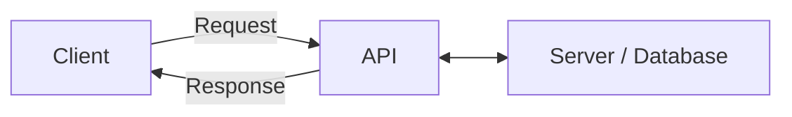
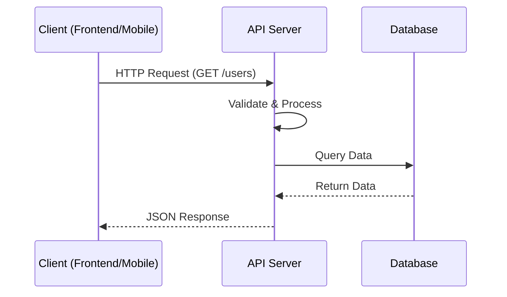
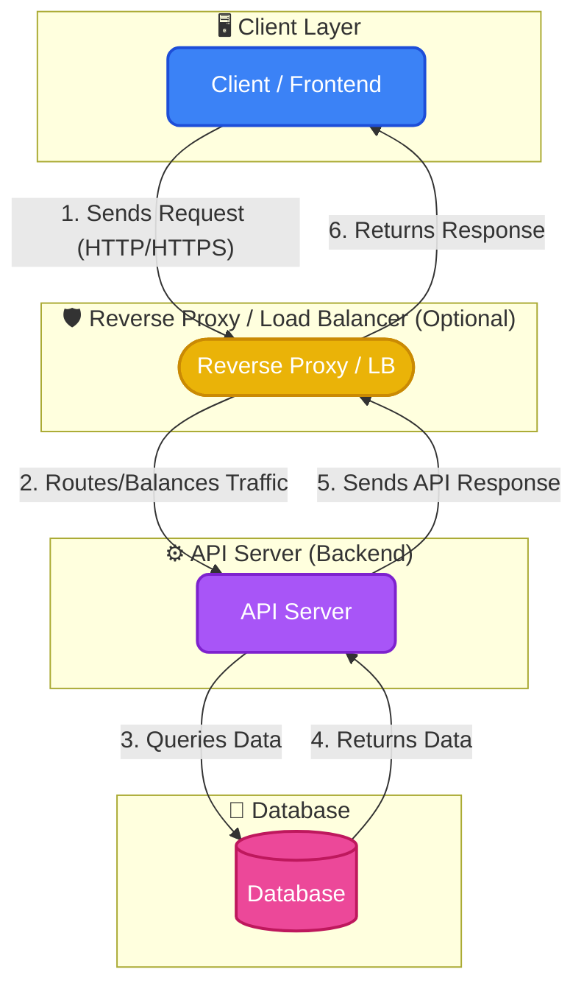
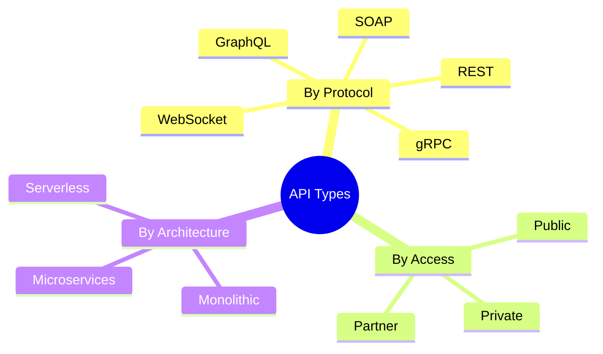
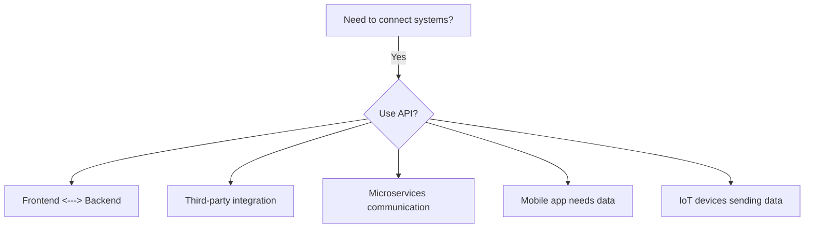
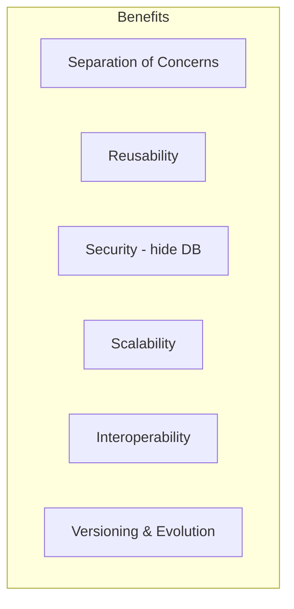
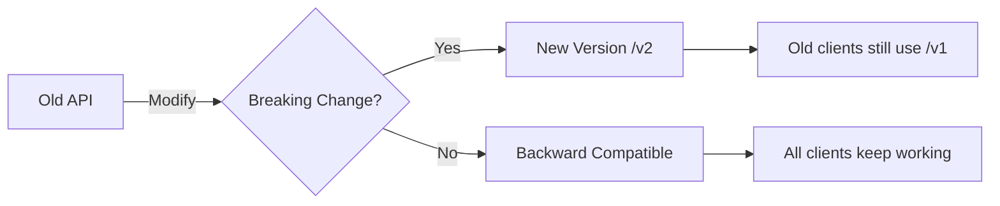
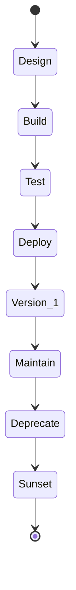
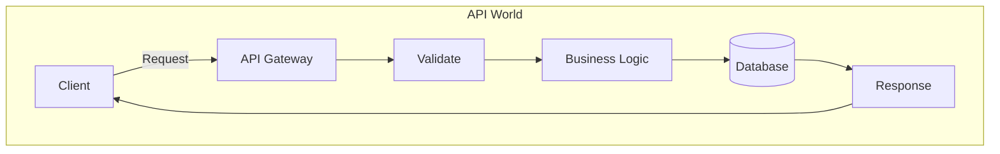

# Full About API

## 1. What is an API?



**API = Application Programming Interface** — a bridge that lets two applications talk to each other.

---

## 2. How It Works



1. Client sends a **request** (e.g., HTTP)
2. API **validates & processes** the request
3. API Talks to **server / database** if needed
4. API sends back a **response** (usually JSON/XML)
- Simple Use


---
# Or
- Uncommond use


- Most use



---

## 3. Types of API




| Type | Description | Example |
|------|-------------|---------|
| **REST** | Stateless, uses HTTP methods | Most web APIs |
| **GraphQL** | Client queries exact data | GitHub API v4 |
| **SOAP** | Strict XML-based protocol | Banking systems |
| **gRPC** | High-performance, binary | Microservices |
| **WebSocket** | Real-time bidirectional | Chat apps |

---

## 4. When to Use an API



- When you separate **frontend from backend**
- When you need **data from another service** (e.g., Stripe, Google Maps, Twitter)
- When you have **multiple clients** (web, mobile, desktop)
- When you want **modular, scalable architecture**
- When building **microservices**

---

## 5. When NOT to Use an API

- **Simple static site** with no dynamic data
- **Direct database access** is fine (small internal tools)
- **Performance-critical** path where HTTP overhead hurts
- **Tiny project** with only one consumer on same server

---

## 6. Why Use an API?



- **Decouples** client from server
- **Reuse** same logic for web, mobile, IoT
- **Security** — database never exposed directly
- **Scales** independently (frontend vs backend)
- **Language agnostic** — any client can talk to any server
- **Evolve** — change backend without breaking clients (with versioning)

---

## 7. Why NOT Use an API? (Downsides)

| Issue | Explanation |
|-------|-------------|
| **Overhead** | HTTP parsing, serialization, network latency |
| **Complexity** | More code to write and maintain |
| **Security surface** | More entry points to attack |
| **Versioning pain** | Breaking changes need migration |
| **Rate limiting** | Need throttling logic |

---

## 8. What If We Modify an API?



- **Breaking change** → create new version (`/v1`, `/v2`)
- **Non-breaking** (add field) → safe to deploy
- Always **document changes**
- Use **deprecation headers** to warn clients

---

## 9. Lifecycle of an API



---

## 10. Common API Patterns

| Pattern | Description |
|---------|-------------|
| RESTful CRUD | GET/POST/PUT/DELETE on resources |
| Pagination | `?page=1&limit=20` |
| Authentication | JWT, OAuth2, API Keys |
| Rate Limiting | `X-RateLimit-Remaining` headers |
| Caching | ETag, Cache-Control |
| Webhooks | Server pushes events to your URL |

---

## 11. API Response Structure (Example)

```json
{
  "success": true,
  "status": 200,
  "data": {
    "id": 1,
    "name": "Tim",
    "email": "tim@example.com"
  },
  "message": "User fetched successfully"
}
```

---

## Summary



> **API is the waiter** between you (client) and the kitchen (server). You tell the waiter what you want, and they bring it back — you never go into the kitchen yourself.

>**Tip Roadmap For Learn Api Development**

