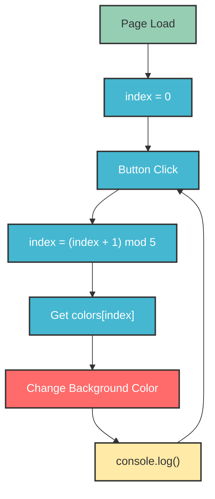
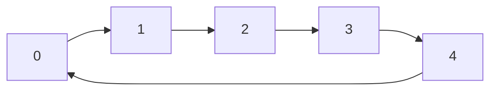

# Module 4: HTML/CSS Review and console.log

**Duration:** ~44 minutes  
**Video Timestamp:** 01:07:32 - 01:51:06

## Learning Objectives

- Set up VS Code for web development
- Understand HTML structure and syntax
- Learn CSS basics for styling
- Use console.log() effectively for debugging
- Link JavaScript files to HTML

## Setting Up Your Development Environment

### Installing VS Code

1. Go to [code.visualstudio.com](https://code.visualstudio.com/)
2. Download the version for your operating system
3. Install and open VS Code

### Recommended VS Code Extensions

- **Live Server** - Automatically refreshes your browser when you save
- **Prettier** - Formats your code automatically
- **ESLint** - Catches JavaScript errors

### VS Code Settings

```json
{
  "editor.formatOnSave": true,
  "editor.tabSize": 2,
  "emmet.includeLanguages": {
    "javascript": "javascriptreact"
  }
}
```

## HTML Basics

### What is HTML?

HTML (HyperText Markup Language) provides the structure of a webpage.

### Basic HTML Structure

```html
<!DOCTYPE html>
<html>
<head>
  <title>My First Page</title>
</head>
<body>
  <h1>Hello, World!</h1>
  <p>This is my first webpage.</p>
</body>
</html>
```

### HTML Elements

**Headings:**
```html
<h1>Heading 1</h1>
<h2>Heading 2</h2>
<h3>Heading 3</h3>
<h4>Heading 4</h4>
<h5>Heading 5</h5>
<h6>Heading 6</h6>
```

**Paragraphs and Text:**
```html
<p>This is a paragraph.</p>
<span>This is inline text.</span>
<strong>Bold text</strong>
<em>Italic text</em>
```

**Lists:**
```html
<!-- Unordered list -->
<ul>
  <li>Item 1</li>
  <li>Item 2</li>
  <li>Item 3</li>
</ul>

<!-- Ordered list -->
<ol>
  <li>First item</li>
  <li>Second item</li>
  <li>Third item</li>
</ol>
```

**Links:**
```html
<a href="https://www.google.com">Visit Google</a>
<a href="page.html">Go to Page</a>
```

**Images:**
```html

```

**Buttons:**
```html
<button>Click Me!</button>
```

### Attributes

HTML elements can have attributes:

```html
<a href="https://example.com" target="_blank">Link</a>

<input type="text" placeholder="Enter name">
<button class="primary" id="submit-btn">Submit</button>
```

### Multiple Spaces and Line Breaks

By default, HTML combines multiple spaces into one:

```html
<!-- This displays as single space -->
<p>Hello     World</p>

<!-- Use <br> for line breaks -->
<p>Line 1<br>Line 2</p>

<!-- Use &nbsp; for non-breaking spaces -->
<p>Hello&nbsp;&nbsp;&nbsp;World</p>
```

## CSS Basics

### Adding CSS to HTML

**Inline CSS:**
```html
<p style="color: red;">Red text</p>
```

**Internal CSS:**
```html
<head>
  <style>
    p {
      color: blue;
      font-size: 16px;
    }
  </style>
</head>
```

**External CSS (Recommended):**
```html
<head>
  <link rel="stylesheet" href="styles.css">
</head>
```

### CSS Syntax

```css
selector {
  property: value;
  property: value;
}
```

### Common CSS Properties

**Text Styling:**
```css
p {
  color: #333;
  font-size: 16px;
  font-family: Arial, sans-serif;
  text-align: center;
}
```

**Colors:**
```css
.red { color: red; }
.blue { color: #3498db; }
.green { color: rgb(46, 204, 113); }
```

**Background:**
```css
.box {
  background-color: #f0f0f0;
  padding: 20px;
  margin: 10px;
}
```

**Borders:**
```css
.box {
  border: 1px solid #ccc;
  border-radius: 5px;
}
```

**Display:**
```css
.inline { display: inline; }
.block { display: block; }
.hidden { display: none; }
```

## Linking JavaScript to HTML

### External JavaScript File

**HTML:**
```html
<!DOCTYPE html>
<html>
<head>
  <title>My Page</title>
  <link rel="stylesheet" href="styles.css">
</head>
<body>
  <h1>Hello</h1>
  <script src="script.js"></script>
</body>
</html>
```

**JavaScript (script.js):**
```javascript
console.log('Hello from external file!');
```

### Script Placement

Scripts can go in `<head>` or `<body>`:
- Put at the end of `<body>` for better page load performance
- Use `defer` attribute in `<head>` for same effect

```html
<!-- Method 1: End of body -->
<body>
  <h1>Hello</h1>
  <script src="script.js"></script>
</body>

<!-- Method 2: Defer in head -->
<head>
  <script src="script.js" defer></script>
</head>
```

## Using console.log()

### Basic Usage

```javascript
console.log('Hello!');
console.log(42);
console.log(true);
console.log([1, 2, 3]);
```

### Logging Multiple Values

```javascript
let name = 'John';
let age = 30;
console.log('Name:', name, 'Age:', age);
// Output: Name: John Age: 30
```

### Console Methods

```javascript
console.log('Regular message');
console.warn('Warning message');    // Yellow
console.error('Error message');      // Red
console.info('Info message');        // Blue 'i' icon
```

### Debugging with console.log()

```javascript
let x = 5;
let y = 10;

console.log('x =', x, 'y =', y);
console.log('x + y =', x + y);

// Before making changes
console.log('Before:', x);
x = x * 2;
console.log('After:', x);
```

## Project: Simple HTML Page

Create a file called `index.html`:

```html
<!DOCTYPE html>
<html>
<head>
  <title>JavaScript Course</title>
  <style>
    body {
      font-family: Arial, sans-serif;
      max-width: 800px;
      margin: 0 auto;
      padding: 20px;
    }
    h1 {
      color: #333;
    }
    .card {
      border: 1px solid #ccc;
      border-radius: 8px;
      padding: 20px;
      margin: 10px 0;
    }
    button {
      background-color: #3498db;
      color: white;
      border: none;
      padding: 10px 20px;
      border-radius: 5px;
      cursor: pointer;
    }
    button:hover {
      background-color: #2980b9;
    }
  </style>
</head>
<body>
  <h1>Welcome to JavaScript!</h1>
  
  <div class="card">
    <h2>Lesson 1</h2>
    <p>Open the console (F12) to see JavaScript output.</p>
    <button onclick="sayHello()">Click Me!</button>
  </div>

  <script>
    console.log('Welcome to JavaScript!');
    
    function sayHello() {
      console.log('Hello! Thanks for clicking!');
    }
  </script>
</body>
</html>
```

## Live Server Setup

### Installing Live Server

1. Open VS Code
2. Go to Extensions (Ctrl+Shift+X)
3. Search for "Live Server"
4. Click Install

### Using Live Server

1. Open your HTML file
2. Right-click in the editor
3. Select "Open with Live Server"
4. Your page opens in the browser with auto-refresh

### Alternative: Manual Refresh

If you don't want Live Server, simply:
1. Open your HTML file directly in the browser
2. Make changes to your code
3. Save the file
4. Refresh the browser (F5 or Ctrl+R)

## Practice Exercises

### Exercise 4.1: Create Your First Page
Create an HTML page with:
1. A heading with your name
2. A paragraph introducing yourself
3. A button that logs a message when clicked

### Exercise 4.2: Console Debugging
Create a JavaScript file that calculates and logs:
1. Area of a rectangle (width: 10, height: 5)
2. Circumference of a circle (radius: 7)
3. Average of 5 numbers

```javascript
// Rectangle area
let width = 10;
let height = 5;
console.log('Rectangle area:', width * height);

// Circle circumference (2 * π * r)
let radius = 7;
console.log('Circle circumference:', 2 * Math.PI * radius);

// Average of numbers
let numbers = [10, 20, 30, 40, 50];
let sum = numbers[0] + numbers[1] + numbers[2] + numbers[3] + numbers[4];
console.log('Average:', sum / numbers.length);
```

### Exercise 4.3: Interactive Styling
Create a page with a button that changes the background color when clicked.

```html
<!DOCTYPE html>
<html>
<head>
  <title>Color Changer</title>
  <style>
    body {
      transition: background-color 0.3s;
      padding: 50px;
      text-align: center;
    }
  </style>
</head>
<body>
  <h1>Click to Change Background</h1>
  <button id="colorBtn">Change Color</button>

  <script>
    let colors = ['#ff6b6b', '#4ecdc4', '#45b7d1', '#96ceb4', '#ffeaa7'];
    let index = 0;
    
    document.getElementById('colorBtn').onclick = function() {
      index = (index + 1) % colors.length;
      document.body.style.backgroundColor = colors[index];
      console.log('Color changed to:', colors[index]);
    };
  </script>
</body>
</html>
```
## How it works


## Notic:
| Expression | Division              | Remainder | Result |
| ---------- | --------------------- | --------- | ------ |
| 1 % 5      | 1 ÷ 5 = 0 remainder 1 | 1         | 1      |
| 2 % 5      | 2 ÷ 5 = 0 remainder 2 | 2         | 2      |
| 3 % 5      | 3 ÷ 5 = 0 remainder 3 | 3         | 3      |
| 4 % 5      | 4 ÷ 5 = 0 remainder 4 | 4         | 4      |
| 5 % 5      | 5 ÷ 5 = 1 remainder 0 | 0         | 0      |
| 6 % 5      | 6 ÷ 5 = 1 remainder 1 | 1         | 1      |
| 7 % 5      | 7 ÷ 5 = 1 remainder 2 | 2         | 2      |


## Summary

- Use VS Code as your code editor with Live Server extension
- HTML provides structure using tags and elements
- CSS styles elements using selectors and properties
- Link JavaScript files using `<script src="file.js"></script>`
- Use `console.log()` for debugging and output
- Place scripts at the end of `<body>` or use `defer`
## Prevouse

[Proceed to Module 3](../03-strings/README.md)
## Next Steps

[Proceed to Module 5](../05-variables/README.md): Variables to learn how to store and manage data in JavaScript.
