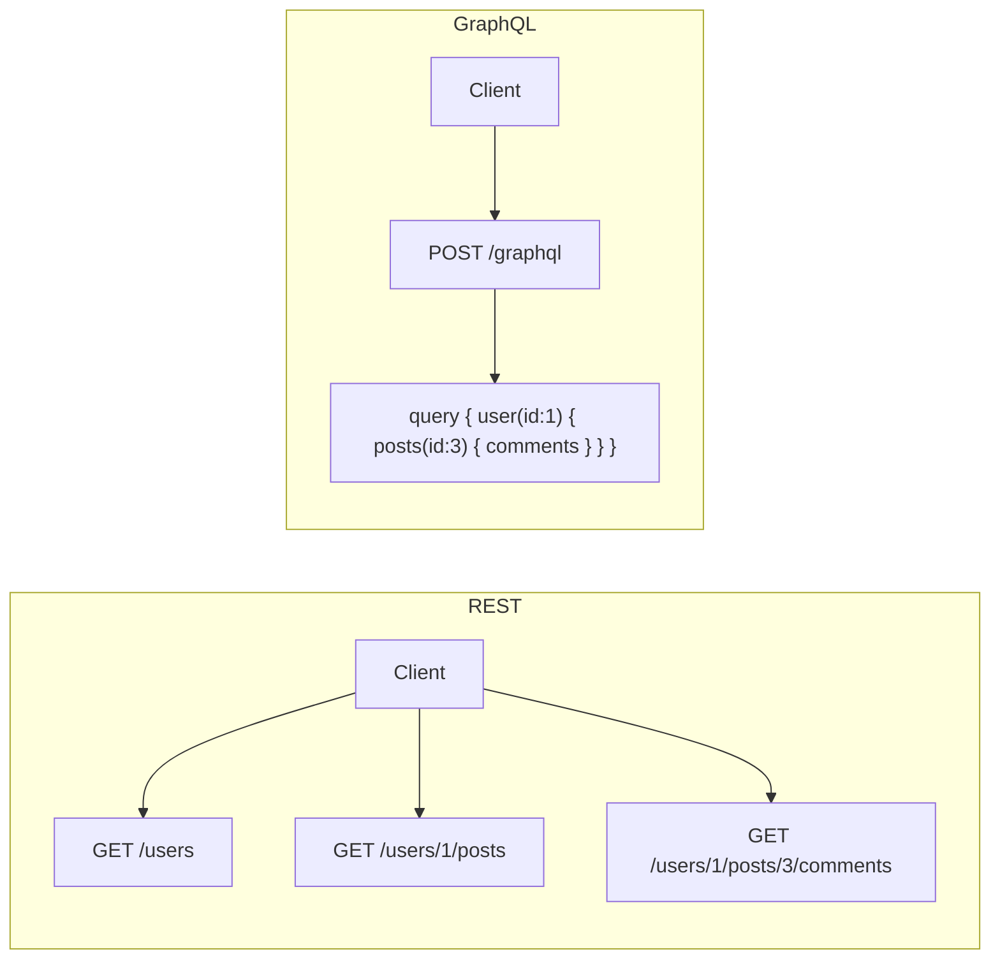
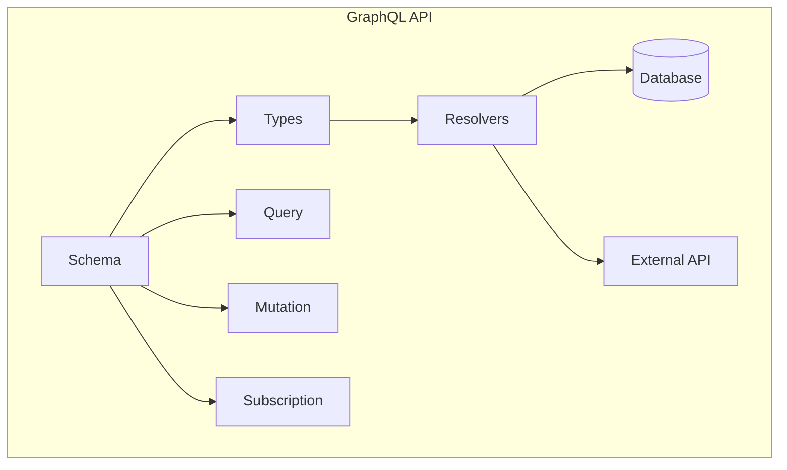
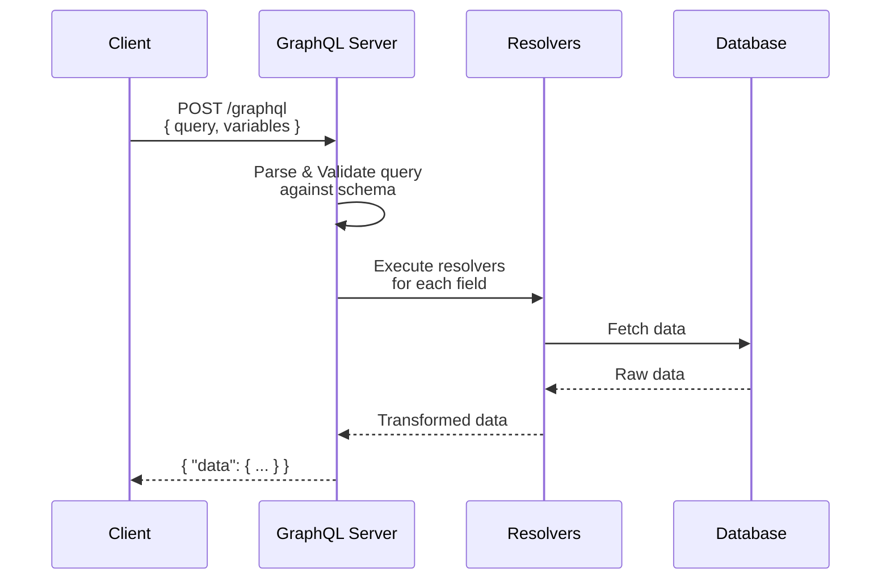
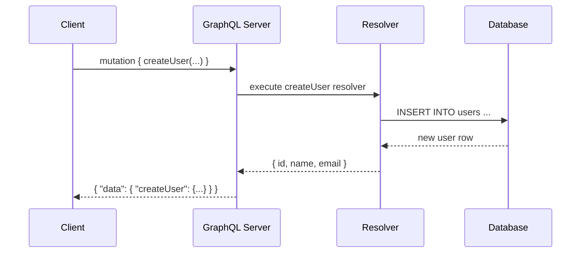
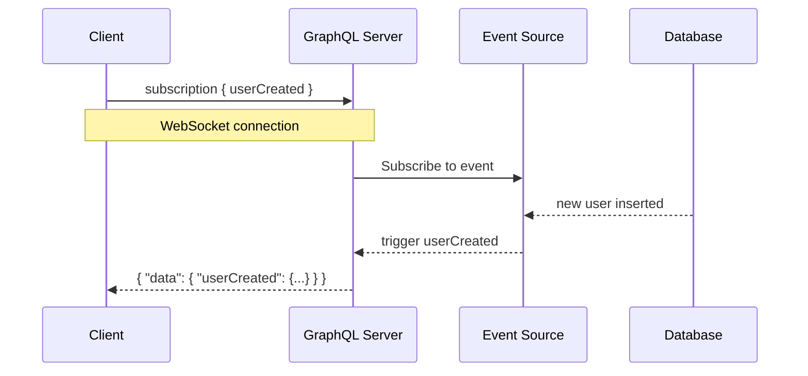
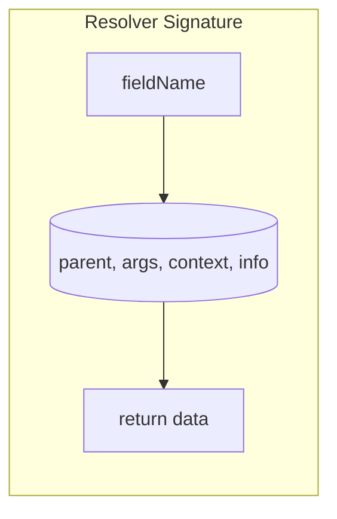
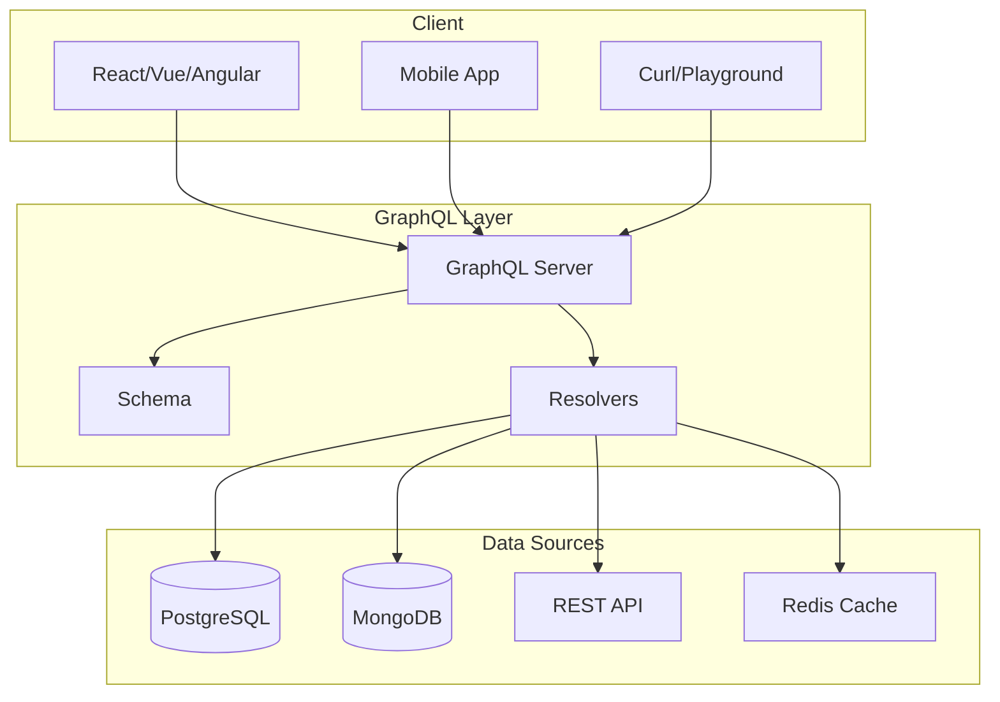
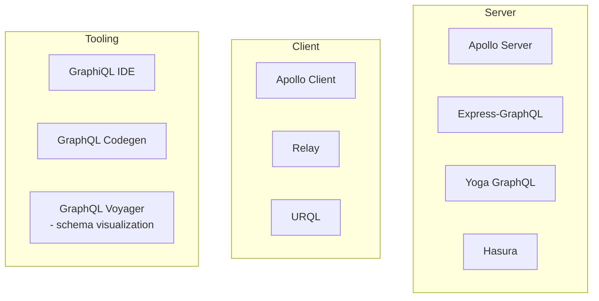
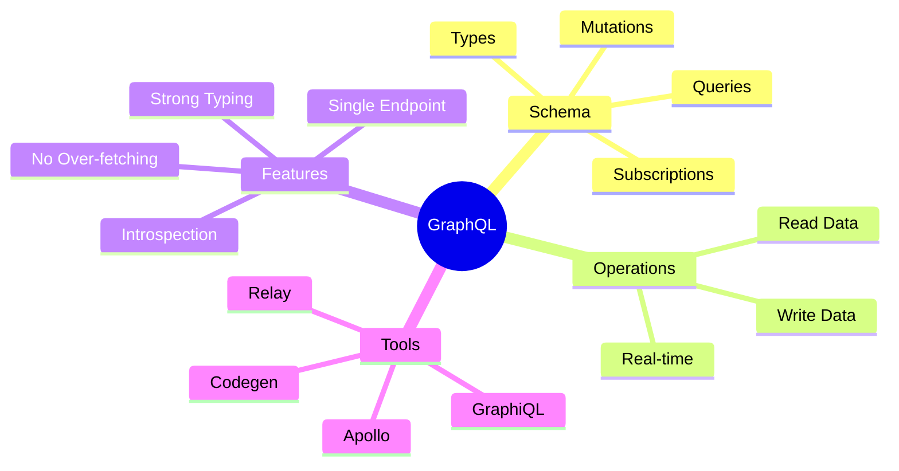

# GraphQL — Deep Dive

## 1. What is GraphQL?

GraphQL is a **query language** for APIs and a **runtime** for executing those queries. Developed by Meta in 2012, open-sourced in 2015.

### GraphQL vs REST



| Feature | REST | GraphQL |
|---------|------|---------|
| Data fetching | Multiple endpoints | Single endpoint |
| Over/under-fetching | Common | Client decides |
| Response shape | Server-defined | Client-defined |
| Versioning | /v1/, /v2/ | Evolve schema |

---

## 2. Core Concepts



### Schema

The **schema** defines the shape of your data and operations. Written in SDL (Schema Definition Language).

### Types

Every field in GraphQL has a type. Built-in scalar types:

| Type     | Example          |
|----------|------------------|
| `String` | `"hello"`        |
| `Int`    | `42`             |
| `Float`  | `3.14`           |
| `Boolean`| `true`           |
| `ID`     | `"abc123"`       |

### Operations

| Operation      | Purpose                  | Analogy        |
|----------------|--------------------------|----------------|
| **Query**      | Read data                | GET            |
| **Mutation**   | Write data               | POST/PUT/DELETE|
| **Subscription** | Real-time data stream  | WebSocket      |

---

## 3. Schema Definition Language (SDL)

### Defining Types

```graphql
type User {
    id: ID!
    name: String!
    email: String!
    age: Int
    posts: [Post!]!
}

type Post {
    id: ID!
    title: String!
    content: String!
    author: User!
    createdAt: String!
}
```

> `!` means **non-nullable** — the field will always return a value.

### The Query Type

```graphql
type Query {
    users: [User!]!
    user(id: ID!): User
    posts: [Post!]!
}
```

### The Mutation Type

```graphql
type Mutation {
    createUser(name: String!, email: String!): User!
    deleteUser(id: ID!): Boolean!
}
```

### The Subscription Type

```graphql
type Subscription {
    userCreated: User!
    postAdded(postId: ID!): Post
}
```

---

## 4. Queries in Action

### Basic Query

```graphql
query GetUsers {
    users {
        id
        name
        email
    }
}
```

Response:

```json
{
    "data": {
        "users": [
            { "id": "1", "name": "Alice", "email": "alice@example.com" },
            { "id": "2", "name": "Bob", "email": "bob@example.com" }
        ]
    }
}
```

### Nested Query

```graphql
query GetUserWithPosts {
    user(id: "1") {
        name
        email
        posts {
            title
            content
        }
    }
}
```

### With Variables

```graphql
query GetUser($userId: ID!) {
    user(id: $userId) {
        name
        email
    }
}
```

Variables JSON:

```json
{
    "userId": "1"
}
```

### Query Flow Diagram



---

## 5. Mutations

### Mutation Example

```graphql
mutation CreateNewUser($name: String!, $email: String!) {
    createUser(name: $name, email: $email) {
        id
        name
        email
    }
}
```

### Mutation Flow Diagram



---

## 6. Subscriptions

Real-time connection (usually over WebSocket):

```graphql
subscription OnUserCreated {
    userCreated {
        id
        name
        email
    }
}
```



---

## 7. Resolvers

Resolvers are functions that return data for each field.

```javascript
const resolvers = {
    Query: {
        users: () => db.getAllUsers(),
        user: (_, { id }) => db.getUserById(id),
    },
    User: {
        posts: (parent) => db.getPostsByUser(parent.id),
    },
    Mutation: {
        createUser: (_, { name, email }) => db.createUser({ name, email }),
    },
};
```

### Resolver Shape



| Parameter  | Purpose                           |
|------------|-----------------------------------|
| `parent`   | The result from the parent resolver |
| `args`     | Arguments passed to the field     |
| `context`  | Shared context (auth, DB, etc.)   |
| `info`     | Query execution info              |

---

## 8. Full Architecture



---

## 9. Why Use GraphQL?

- **Exact data** — ask for what you need, get only that
- **Strong typing** — schema is the contract between client and server
- **Single endpoint** — no more URL versioning
- **Introspection** — self-documenting API
- **Developer tools** — GraphiQL, Apollo DevTools

## 10. Tooling Ecosystem



---

## Summary


