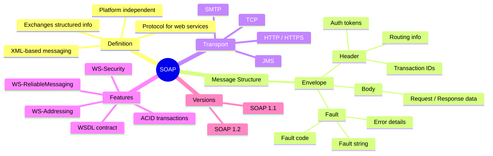
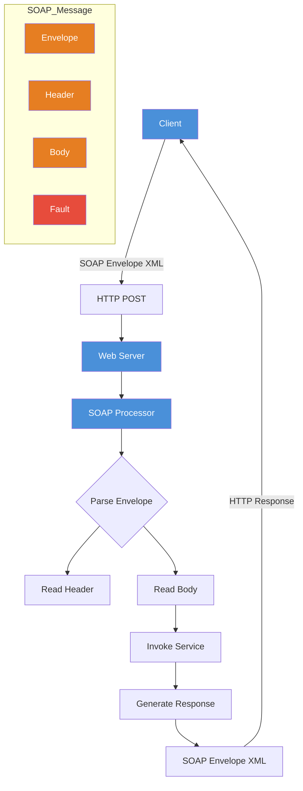
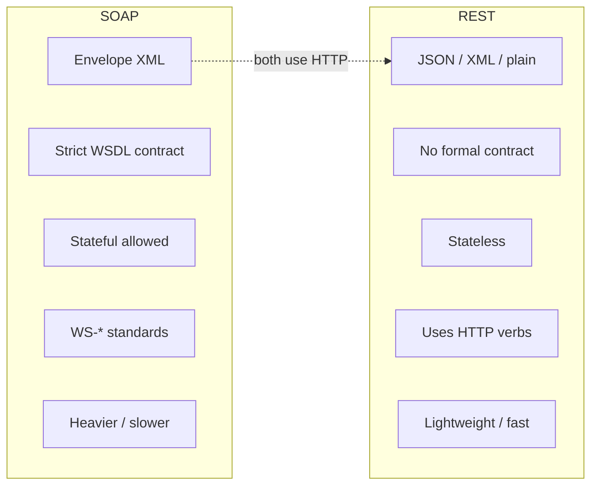

# SOAP — Simple Object Access Protocol





```mermaid
blockquote
    SOAP is a protocol for exchanging XML-based messages over a network.
    It uses an Envelope that wraps the Header and Body.
    The Header carries metadata (security, routing).
    The Body carries the actual request or response data.
    A Fault element reports errors.
    SOAP is often paired with WSDL for service description.
```

## Example SOAP Request

```xml
<?xml version="1.0"?>
<soap:Envelope
  xmlns:soap="http://schemas.xmlsoap.org/soap/envelope/"
  soap:encodingStyle="http://schemas.xmlsoap.org/soap/encoding/">

  <soap:Header>
    <auth:Authentication xmlns:auth="http://example.com/auth">
      <auth:Token>abc123</auth:Token>
    </auth:Authentication>
  </soap:Header>

  <soap:Body>
    <getPrice xmlns="http://example.com/stock">
      <symbol>GOOG</symbol>
    </getPrice>
  </soap:Body>

</soap:Envelope>
```

## Key Takeaways

| Concept | Description |
|---------|-------------|
| **Envelope** | Root element, mandatory, defines XML namespaces |
| **Header** | Optional, carries metadata (security, routing) |
| **Body** | Mandatory, contains call/response data |
| **Fault** | Optional, carries error info |
| **WSDL** | Web Service Description Language — contract |
| **Transport** | Usually HTTP, but protocol agnostic |

---

## SOAP vs REST



| Aspect | SOAP | REST |
|--------|------|------|
| **Protocol** | Protocol (strict spec) | Architectural style |
| **Message format** | XML only | JSON, XML, plain text, etc. |
| **Contract** | WSDL (strict) | OpenAPI / Swagger (optional) |
| **State** | Supports stateful ops | Stateless by design |
| **Transport** | HTTP, SMTP, JMS, TCP | HTTP / HTTPS only |
| **Security** | WS-Security (built-in) | HTTPS + tokens (JWT, OAuth) |
| **Performance** | Heavier (XML parsing) | Lighter (JSON, less overhead) |
| **Caching** | Not built-in | HTTP caching (GET) |
| **Discovery** | WSDL / UDDI | URLs / docs |
| **Error handling** | SOAP Fault (structured) | HTTP status codes |
| **Best for** | Enterprise, banking, telecom | Public APIs, mobile, web apps |

```mermaid
blockquote
    SOAP = rigid contract, lots of XML, built-in security, enterprise-grade.
    REST = flexible, lightweight, stateless, great for modern web/mobile APIs.
    Neither is "better" — pick based on your use case.
```

